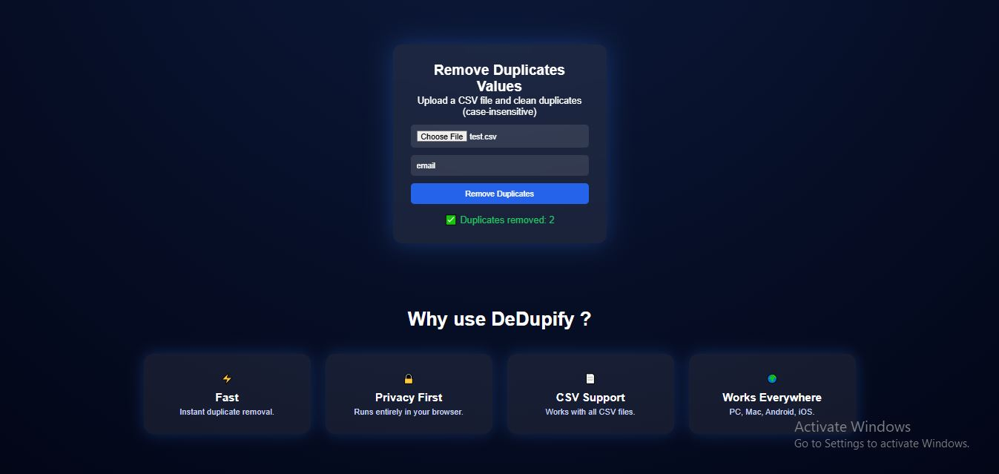

# 🧹 DeDupify - Smart Speadsheet Cleaner

**DeDupify** is a lightweight, browser-based tool that helps you **clean CSV files by removing duplicate** values instantly. No uploads, no backend, no data leaving your device.

## 🚀 Features

- ⚡ **Fast & Lightweight** - Runs fully in your browser
- 🔒 **Privacy First** — No file uploads, no servers
- 📄 **CSV Support** — Works with standard CSV files
- 🧠 **Case-Insensitive Cleaning** — Smart duplicate detection
- 🌍 **Works Everywhere** — Any modern browser

## 📸 Screenshots
- **Main UI**


- **Duplictes Removed**


## 🛠️ Technologies used

- **HTML5**
- **CSS3** (Glassmorphism + Responsive Layout)
- **Vanilla JavaScript** (No frameworks)

## ▶️ How to Run the Project

DeDupify is a frontend-only web application and does not require any backend or installations.
### Steps to Run:
1. Clone the repository
   ```bash
   git clone https://github.com/your-username/DeDupify.git                                                                                                                                                                                                                                                                                                                                                                                                                                                                                                                                                                                                                                                                                                                                                                                                                                                                                                               
2. Navigate to the project folder
    ```bash
    cd DeDupify
3. Open the application:
    Open `index.html` in any modern web browser (Chrome, Edge, Firefox, Brave).
The application will run locally in your browser.
    
## ⚠️ Limitations
 - 🧩 **Single column processing**

   Duplicate removal works on one specified column at a time.
 - 📊 **Large file constraints**

   Very large CSV files may cause slow performance due to browser memory limitations. 
 - 🧠 **Basic CSV parsing**

   Complex CSV cases such as:
     - Commas inside quoted values
     - Multiline cells
      
    may not be handled correctly.
  - 📄 **CSV format only**

    Currently supports only `.csv` files (Excel `.xlsv` is not supported yet).
  - 🕘 **No history or storage**

      Cleaned files are not stored or tracked after download. 

## 🧩 Future Enhancements
- Multiple column selection
- Preview cleaned data before download
- History & downloads tab
- Drag & drop CSV upload
- Support for Excel (.xlsx)


#### ⭐ If you like this project, don’t forget to star the repository!
